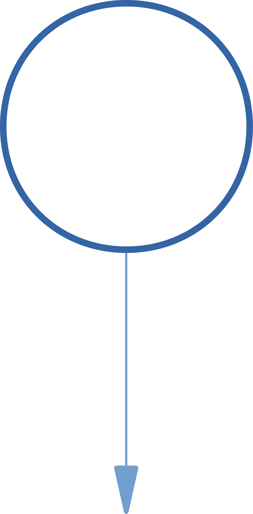
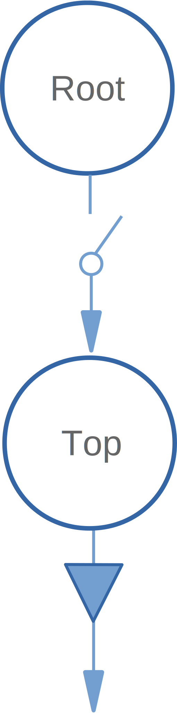

# Scenegraph Structures

This section goes into detail about the scenegraph node structures generated and maintained by the pivy_trackers classes.  If you are unfamiliar with scenegraphs and how they work, it will be helpful to develop at least a general understanding.  

A few links of general information:

* [WebGL scenegraph fundamentals](https://webglfundamentals.org/webgl/lessons/webgl-scene-graph.html)
* [gamedev.net explanation](http://archive.gamedev.net/archive/reference/programming/features/scenegraph/index.html)
* [StackOverflow question](https://stackoverflow.com/questions/5319282/game-engines-what-are-scene-graphs)

Additionally, links to the Coin3D documentation for referenced scenegraph nodes:

* [SoBaseColor](https://grey.colorado.edu/coin3d/classSoBaseColor.html)
* [SoCoordinate3](https://grey.colorado.edu/coin3d/classSoCoordinate3.html)
* [SoDrawStyle](https://grey.colorado.edu/coin3d/classSoDrawStyle.html)
* [SoEventCallback](https://grey.colorado.edu/coin3d/classSoEventCallback.html)
* [SoFCSelection]
* [SoGroup](https://grey.colorado.edu/coin3d/classSoGroup.html)
* [SoLineSet](https://grey.colorado.edu/coin3d/classSoLineSet.html)
* [SoMarkerSet](https://grey.colorado.edu/coin3d/classSoMarkerSet.html)
* [SoPickStyle](https://grey.colorado.edu/coin3d/classSoPickStyle.html)
* [SoSeparator](https://grey.colorado.edu/coin3d/classSoSeparator.html)
* [SoSwitch](https://grey.colorado.edu/coin3d/classSoSwitch.html)
* [SoTransform](https://grey.colorado.edu/coin3d/classSoTransform.html)

Most of the [[traits]] in pivy_trackers create a corresponding scenegraph node structure to provide it's functionality.

Included here is a list of each trait (and the base tracker classes) and their corresponding scenegraph node structures

## CoinGroup

The CoinGroup class lies at the heart of the pivy-tracker traits and trackers.  This class provides the base node structure
for each trait / tracker and determines whether or not the effects of the trait / tracker may be felt beyond
their sibling / child nodes as well as making them switchable to enable / disable the effect of their nodes.

A CoinGroup object  scenegraph node structure consists of one or two of the following nodes:
 
<table margin: 0 auto>
    <tr>
        <th scope="col">Switch</th>
        <th scope="col">Group</th>
        <th scope="col">Separator</th>
    </tr>
    <tr>
        <td></td>
        <td></td>
        <td></td>
    </tr>
</table>
 
Specifically, a CoinGroup may be any one of these nodes individually, or a combination of a Switch node and a Group or Separator node.
The Switch node may also act as the parent or child of the group / separator node.

## Trait Structures
***
### Base Structure

This node structure provides the greatest control and safety, making it switched, so it can or cannot be traversed,
as well as separated - insulating the remainder of the scenegraph from it's effects.
***
### Drag Structure

 NOT YET IMPLEMENTED
***
### Event Structure

The Event trait adds a switched group, allowing it's effects to influence siblings of it's parent switch.
This node structure may consist of one or more SoEventCallback nodes, which provide node-level input event notification
for keyboard, mice, and other devices.
***
### Geometry Structure

The Geometry trait adds a simple group with a SoTransform and SoCoordinate3 node.  Thus transformations applied
to the geometry node will also be applied to subsequent sibling / child geometry nodes
***
### Pick Structure

The Pick trait adds an SoPickStyle node to the base node group, thus it's a child of the Base SoSeparator node.
***
### Select Structure

The Select trait adds a SoFCSelection node (FreeCAD-specific) to the base node group separator.
***
### Style Structure

The Style trait adds a SoGroup node with SoBaseColor and SoDrawStyle nodes as immediate children
Thus, effects of these nodes are applied to all siblings and children following it's traversal

***
## Tracker Structures

Several basic trackers are provided for inclusion in custom tracker classes or to serve as base classes
for inheritance.  These classes set up and provide fully-functional trackers with a minimum of effort.

***
### Geometry Tracker Structure

The Geometry Tracker builds out the Base node with Style, Event, Select, and Geometry node structures.

***
### Marker Tracker Structure
*(Geometry trait node)*

The Marker Tracker inherits the Geometry Tracker node structure, appending a SoMarkerSet node to the
node structure generated by the Geometry trait class.
***
### Line Tracker Structure 
*(Geometry trait node)*

The Line Tracker inherits the Geometry Tracker node structure, appending a SoLineSet node to the
node structure generated by the Geometry trait class.
